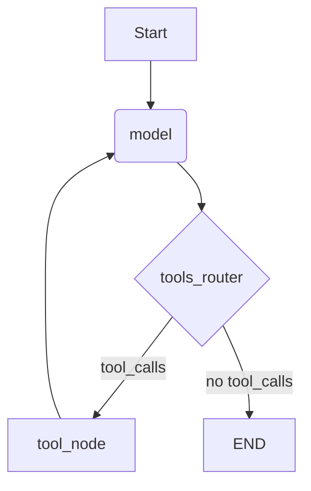
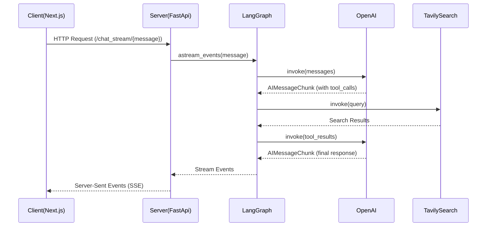

# 실시간 검색 Agent

Langgraph, OpenAI API, Next.js, Tavily API 를 활용하여 실시간 검색 에이전트 개발
perplexity.ai 와 유사한 UI 구성
- Based on the great work by [harishneel1/perplexity_2.0](https://github.com/harishneel1/perplexity_2.0)

## ✨ Features

- **Real-time AI Responses** - Responses stream live as the AI generates them.
- **Integrated Web Search** - AI can search the web for up-to-date information
- **Conversation Memory** - Maintains context throughout your conversation
- **Search Process Transparency** - Visual indicators show searching, reading, and writing stages
- **Responsive Design** - Clean, modern UI that works across devices

## 🏗️ Architecture

This project follows a client-server architecture:

### Client (Next.js + React)
- Modern React application built with Next.js
- Real-time streaming updates using Server-Sent Events (SSE)
- Components for message display, search status, and input handling

### Server (FastAPI + LangGraph)
- Python backend using FastAPI for API endpoints
- LangGraph implementation for conversation flow with LLM and tools
- Integration with Tavily Search API for web searching capabilities
- Server-Sent Events for real-time streaming of AI responses


## 📊 Diagrams

### LangGraph Flow



### Client-Server Architecture



## 🚀 Getting Started

### Prerequisites

- Node.js 18+
- Python 3.10+
- OpenAI API key
- Tavily API key

### Installation

1. **Clone the repository**
   ```bash
   git clone https://github.com/TwOneZero/LanggraphSearchAgent.git
   cd LanggraphSearchAgent

2. **Set up the server**
   ```bash
   cd server
   python -m venv venv # or uv, poetry ...
   source venv/bin/activate  # On Windows: . .\venv\Scripts\activate
   pip install -r requirements.txt

3. **Configure environment variables**  
   Create a `.env` file in the server directory:
   OPENAI_API_KEY=your_openai_api_key
   TAVILY_API_KEY=your_tavily_api_key
   
4. **Set up the client**
```bash
cd ../client
npm install
```
### Running the Application

1. **Start the server**
   ```bash
   cd server
   uvicorn app:app --reload

2. **Start the client**
   ```bash
   cd client
   npm run dev

3. **Open your browser and navigate to http://localhost:3000**   

## 🔍 How It Works

1. **User sends a message** through the chat interface
2. **Server processes the message** using GPT-4o
3. **AI decides** whether to use search or respond directly
4. If search is needed:
   - Search query is sent to Tavily API
   - Results are processed and provided back to the AI
   - AI uses this information to formulate a response
5. **Response is streamed** back to the client in real-time
6. **Search stages are displayed** to the user (searching, reading, writing)


## 🚀 Future Updates

Planned features and improvements:

- **File Upload & Analysis**
  - Support for document uploads (PDFs, TXT, etc.)
  - Document analysis and Q&A capabilities
  
- **Enhanced RAG Implementation**
  - Integration with Pinecone for efficient vector storage
  - OpenAI embeddings for better semantic search
  - Improved context retrieval and response accuracy

- **Persistent Memory**
  - Database integration for conversation history
  - Long-term context preservation across sessions
  - Enhanced conversation continuity

## 🙏 Acknowledgments

- Inspired by the UI and functionality of [Perplexity.ai](https://www.perplexity.ai/)
- Built with [Next.js](https://nextjs.org/), [React](https://reactjs.org/), [FastAPI](https://fastapi.tiangolo.com/), and [LangGraph](https://github.com/langchain-ai/langgraph)
- Powered by [OpenAI GPT-4o](https://openai.com/) and [Tavily Search API](https://tavily.com/)
